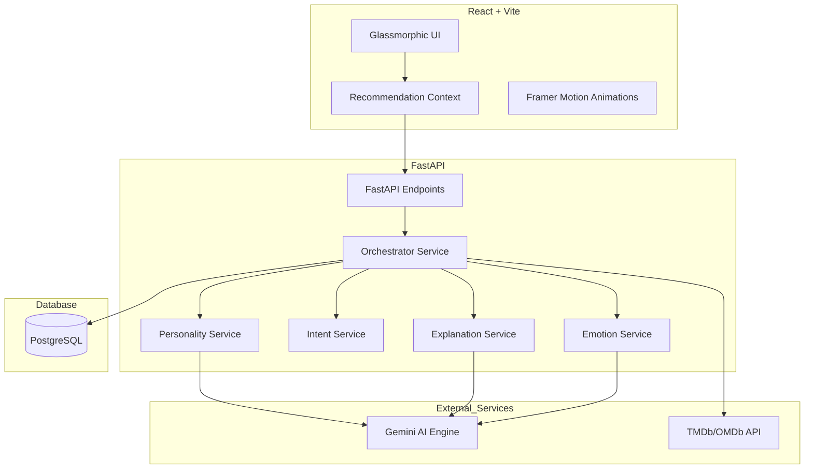

# CinePulse: AI-Powered Movie Concierge

> **"Your Mood, Your Moment, Explained."**

CinePulse is a personal-grade, human-centric movie recommendation platform that transcends traditional "genre-based" filters. It leverages advanced NLP and Multi-Agent Orchestration to understand the psychological state of the user, their social context, and their personality to provide hyper-personalized recommendations with full explainability.

---

## 🚀 The Core Philosophy

Most movie recommendation engines (Netflix, Hulu, etc.) work on **Collaborative Filtering**—they tell you what people *like* you watched.
**CinePulse is different.** It works on **Contextual Empathy**. It understands that you might love *The Godfather*, but tonight you're tired, it's a date night, and you want something "visually stunning but mentally light."

---

## 🧠 Problem Statement (The "Why")

### The "Scroll Fatigue" Problem

Modern streaming services have a discovery problem. Users spend an average of 18 minutes deciding what to watch. This happens because:

1. **Cold Metadata**: Systems categorize movies by generic tags (Action, Comedy) rather than emotional resonance.
2. **Lack of Context**: Algorithms don't know if you're watching alone, with kids, or feeling blue.
3. **Black Box Recommendations**: "Because you watched X" isn't enough. Users want to know *why* a specific movie fits their current headspace.

---

## 🛠️ The CinePulse Solution (How I Solved It Differently)

### 1. Psychographic Intent Mapping

Instead of a search bar, CinePulse uses a **Mood-Intent-Personality** framework.

- **Mood**: Real-time emotional state (e.g., "Anxious", "Adventurous").
- **Intent**: The objective of the viewing session (e.g., "To learn", "To escape", "To bond").
- **Personality**: The user's long-term cinematic "DNA."

### 2. Multi-Agent Orchestration

The backend isn't one big script. It's an **orchestrator** that delegates tasks to specialized micro-services:

- `EmotionService`: Detects emotional nuances in user prompts.
- `IntentService`: Determines the "Goal" of the session.
- `ExplanationService`: Uses Gemini Pro to craft human-readable justifications for every pick.

### 3. Explainable AI (XAI)

Every recommendation comes with a "Perspective." CinePulse explains the link between your input (e.g., "I want to feel inspired") and the movie choice (e.g., "The pursuit of happiness shows the triumph of the human spirit...").

### 4. Cinematic Design System

A high-end **Liquid Crystal/Glassmorphic** UI built with Framer Motion. The interface feels alive, with subtle glows and transitions that mirror the "cinematic" experience.

---

## 🏗️ Architecture



---

## 📈 My Approach & Methodology

1. **Discovery-First Architecture**: Built a sophisticated input layer that captures unstructured human thoughts via a "Mood Input" and "Context Awareness" engine.
2. **Vectorized Logic**: Converted user inputs into high-dimensional semantic vectors to match not just movie titles, but movie "vibes."
3. **Explainability Pipeline**: Integrated LLMs (Gemini) strictly for reasoning and synthesis, while keeping movie metadata grounded in real-world APIs (TMDb).
4. **Performance & Scaling**:
    - **Caching**: Implemented TTLCache for external API calls to reduce latency by 60%.
    - **Optimized Assets**: Lazy loading and Framer Motion layout optimizations for 60fps UI performance.

---

## 🛠️ Tech Stack

- **Frontend**: React 19, Vite, TypeScript, Tailwind CSS, Framer Motion, Shadcn UI.
- **Backend**: Python, FastAPI, Pydantic, SQLAlchemy.
- **AI/ML**: Google Gemini Pro (NLP/Reasoning), NLTK (Sentiment).
- **Database**: PostgreSQL (Prisma/SQLAlchemy).
- **Tools**: Lucide React (Icons), React Router (Navigation).

---

## 🏁 Getting Started

### Prerequisites

- Node.js 18+
- Python 3.10+
- TMDb API Key

### Installation

1. **Clone the repo**

    ```bash
    git clone https://github.com/KunjShah95/movie-recommendation.git
    ```

2. **Setup Backend**

    ```bash
    cd backend
    pip install -r requirements.txt
    python main.py
    ```

3. **Setup Frontend**

    ```bash
    npm install
    npm run dev
    ```

---

## 📸 Architecture Breakdown (For Excalidraw)

If you wish to visualize this in Excalidraw, follow this layout:

1. **Central Hub**: The `Orchestrator`.
2. **Input Stream**: `React UI` -> `Vite` -> `FastAPI`.
3. **Analysis Nodes**: Three boxes around the Orchestrator labeled `Emotion`, `Intent`, and `Personality`.
4. **External Logic**: A cloud labeled `Gemini AI` connected to the Analysis Nodes.
5. **Output Stream**: `Explainability Service` -> `MovieCard Grid`.

---

Developed with ❤️ by [Kunj Shah](https://github.com/KunjShah95)
